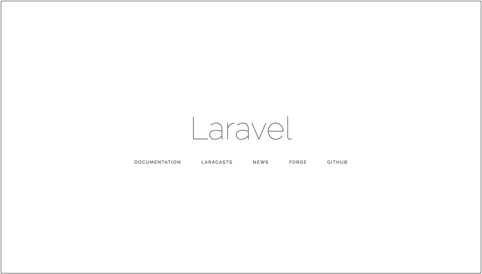
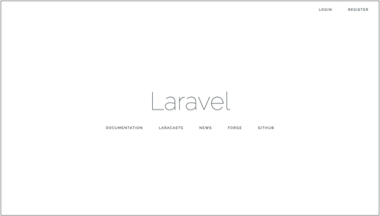
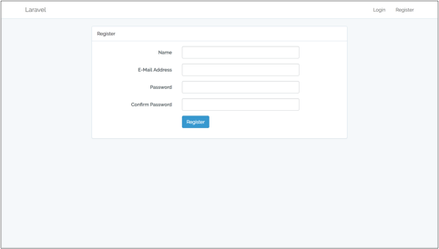
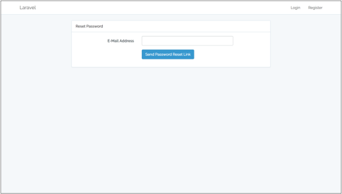
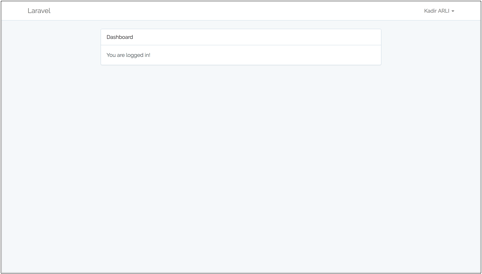

##Laravel Installation

After running below commands in terminal, you will see the laravel welcome page.
```
$ composer create-project --prefer-dist laravel/laravel giteSoftLaravel2 "5.4.*"
```
```
$ chmod -R 777 storage/
```
```
$ chmod -R 777 bootstrap/cache/
```
```
$ php artisan serve
```



##Connect Database

You should change some codes on .env file to connect database.
```
DB_CONNECTION=mysql
DB_HOST=127.0.0.1
DB_PORT=3306
DB_DATABASE=[databaseName]
DB_USERNAME=[databaseUserName]
DB_PASSWORD=[databasePassword]
```
and you should add some codes on App\Providers\AppServiceProvider.
```
use Illuminate\Support\Facades\Schema;

public function boot()
{
    Schema::defaultStringLength(191);
}
```

You are ready for connecting database.

## Laravel Authentication

If you want to use "Laravel Authentication", you should do below things.

```
$ php artisan migrate
```
```
$ artisan make:auth
```










##Gite Soft Laravel Task

Now, let's create project database tables by using laravel migration.

###DB Processes (Tables, Migrations, Eloquent Models and DB Seed)

- Movies Table. (Can have several genres and comments)
```
name [required]
description [required]
release_date [required]
rating [required, 1 to 5]
ticket_price [required]
country_id [required]
photo [required]
slug [required]
```
- Genres Table
```
name [required]
```
- Movie's Genres Table
```
movie_id [required]
genre_id [required]
```
- Comments Table
```
movie_id [required]
name [required]
comment [required]
```
- Country Table
```
name [required]
```

To create migrations files, type below commands.

```
$ php artisan make:migration create_movies_table --create=movies
```
```
$ php artisan make:migration create_genres_table --create=genres
```
```
$ php artisan make:migration create_movie_genres_table --create=movie_genres
```
```
$ php artisan make:migration create_comments_table --create=comments
```
```
$ php artisan make:migration create_countries_table --create=countries
```

After finishing tables migration's code, run below command.

```
$ php artisan migrate
```

Let's create Eloquent\Models of these tables.

```
$ php artisan make:model Movie
```
```
$ php artisan make:model Genre
```
```
$ php artisan make:model Comment
```
```
$ php artisan make:model Country
```

Use countries.sql to fill countries table.
Use genres.sql to fill genres table.

And last process about database is DB SEED.

```
$ php artisan make:seeder MoviesTableSeeder
```
```
$ php artisan make:seeder CommentsTableSeeder
```

After coding in table seeder files, you should run below codes.

```
$ php artisan db:seed --class=MoviesTableSeeder
```
```
$ php artisan db:seed --class=CommentsTableSeeder
```

Or you can run below command

```
$ php artisan db:seed
```

###ApiControllers

```
$ php artisan make:controller MovieController
```

I used JSend rules for responses;
```
composer require shalvah/laravel-jsend
```
I used Intervention for managing image (imagick driver. To use, look http://ralbatross204.blogspot.sk/2013/11/getting-imagemagick-to-work-in-xampp-on.html)
```
composer require intervention/image
```

