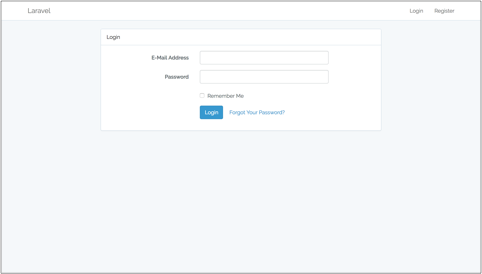

# giteSoftLaravel v2

After running below commands in terminal, you will see the laravel welcome page.
```
$ composer create-project --prefer-dist laravel/laravel giteSoftLaravel2 "5.4.*"
```
```
$ chmod -R 777 storage/
```
```
$ chmod -R 777 bootstrap/cache/
```
```
$ php artisan serve
```


You should change some codes on .env file to connect database.
```
DB_CONNECTION=mysql
DB_HOST=127.0.0.1
DB_PORT=3306
DB_DATABASE=[databaseName]
DB_USERNAME=[databaseUserName]
DB_PASSWORD=[databasePassword]
```
and you should add some codes on App\Providers\AppServiceProvider.
```
use Illuminate\Support\Facades\Schema;

public function boot()
{
    Schema::defaultStringLength(191);
}
```

You are ready for connecting database.

___

If you want to use "Laravel Authentication", you should do below things.

```
$ php artisan migrate
```
```
$ artisan make:auth
```





